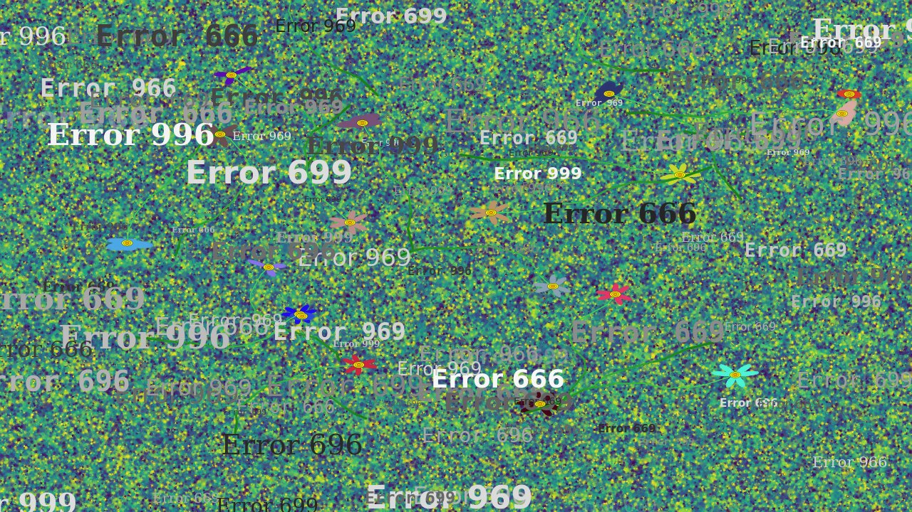
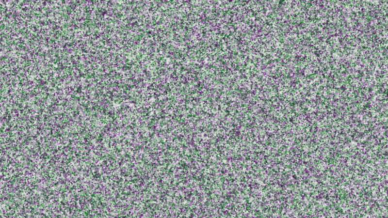
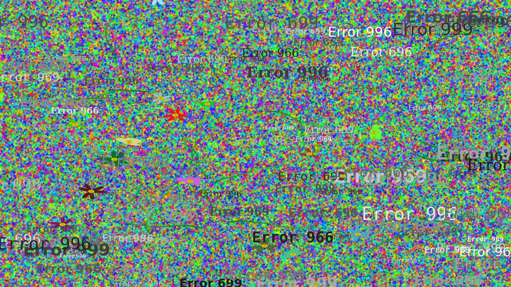

# Crenature @969p · 数字自然的创生

一件由观众触发的生成艺术装置：有人走近，红外传感器通知树莓派，树莓派经 SSH 让迷你主机播放全屏动画。
在随机配色的粒子背景上，20 株花的茎秆逐段生长、花冠逐层展开，最后浮现一片 `Error 666 / 969 / 999…`。
每次运行的画面都不相同。

马赛中央理工学院（École Centrale de Marseille）创新项目 No.48，5 人小组，2025.02 – 2026.01。



<p align="center">
  
  
</p>

## 快速开始

需要 Python ≥ 3.9。

```bash
pip install -r requirements.txt
python -m crenature --windowed --seed 6     # 窗口模式；去掉 --windowed 即全屏展出模式
```

全屏模式下按 `q` 退出，默认 160 秒后自动关闭（`--duration 0` 关闭此行为）。

不开窗口，直接导出图片或动图：

```bash
python -m crenature --seed 6 --snapshot out.png         # 最终画面
python -m crenature --seed 3 --dpi 50 --gif out.gif     # 生长过程，5 倍速
```

| 参数 | 默认 | 说明 |
|---|---|---|
| `--seed` | 随机 | 同一种子、同一 matplotlib 版本得到同一画面 |
| `--dots` | 100000 | 每层背景粒子数（共 3 层）；机器较慢时调小 |
| `--flowers` | 20 | 花的数量 |
| `--errors` | 100 | `Error` 文字数量 |
| `--interval` | 150 | 帧间隔（毫秒），控制生长速度 |
| `--duration` | 160 | 自动关闭时间（秒），0 表示不关闭 |
| `--windowed` | 关 | 不进入全屏 |

## 生成算法

所有随机量在播放前一次性生成（`Scene.__init__`），逐帧只揭示已算好的结果。

- **粒子背景**：同一组随机坐标画三层散点（大而淡的色斑、中等圆点、细颗粒），
  颜色取自随机选中的 matplotlib colormap 的随机一段；每层最大的 100 个点提高不透明度作为高光。
  背景只画一次，播放时作为 blit 的静态底图，不参与逐帧重绘。
- **茎**：带转角约束的随机游走——10 步，每步长 0.01–0.04，每步转向不超过 ±30°；
  线宽由根到梢从 3 收窄到 1，颜色由深绿渐亮。
- **花冠**：三种参数曲线随机选一（`crenature/geometry.py`）：
  - 玫瑰线 r = |sin 3θ + 0.5 sin 6θ| 叠加径向噪声（大小交替的花瓣，每朵都略有不同）
  - x ∝ sin t + k·sin 2t、y ∝ cos t − k·cos 2t 的闭合曲线，k 随机取 −1、0、1（k = 0 时是椭圆）
  - sin θ、sin 2θ、sin 5θ 谐波叠加、半径受 sin 5θ 调制的五角星形
  
  花冠用旋转矩阵对齐茎梢方向，分 10 帧由小到大叠画半透明副本，重叠处颜色更饱和，形成层次；
  最后加上三层同心圆花蕊。纵向乘 16/9 以抵消 16:9 画布的拉伸。
- **Error 969**：花全部开完后，逐帧浮现 100 个只由 6 和 9 组成的错误码，字号、字体、灰度随机，
  越往后越不透明——呼应作品名里的 @969p。

## 展出装置

```
PIR 传感器 ──GPIO17──▶ Raspberry Pi 4B ──SSH(密钥)──▶ Windows 迷你主机 ──任务计划程序──▶ 全屏动画
```

- `pi/sensor_trigger.py`：gpiozero 监听人体红外传感器，10 秒冷却去抖，
  通过免密 SSH 执行 `schtasks /run` 启动 Windows 上的计划任务；`--dry-run` 可不接传感器、按回车模拟。
- `windows/register_task.ps1`：注册"只在用户登录时运行"的计划任务，使窗口出现在已登录的桌面上
  （经 SSH 直接启动的程序看不到窗口）；动画播放期间的重复触发会被忽略。
- `windows/run_crenature.bat`：计划任务实际执行的启动脚本，输出写入日志。

完整步骤（烧录系统、接线、Windows OpenSSH 管理员账户的公钥坑、开机自启、排障）见
[docs/deployment.md](docs/deployment.md)。

## 目录

```
crenature/            动画本体
  config.py           全部可调参数，默认值即展出版
  geometry.py         花冠曲线、旋转、茎的随机游走（纯函数）
  scene.py            背景、花、文字的构建与逐帧更新
  app.py              命令行入口：窗口 / 全屏 / 导出图片与 GIF
pi/                   树莓派端传感器脚本与 systemd 服务
windows/              Windows 端启动脚本与计划任务注册
docs/deployment.md    展出装置部署手册
tests/                pytest：几何、逐帧状态、可复现性、导出、触发去抖
```

## 开发历程

1. **即时绘制原型**：每画一段茎、一片花瓣就调用一次 `plt.pause` 刷新整张图，
   背景粒子一多就明显变慢，早期版本只能靠减少点数和迭代次数提速。
2. **预计算 + FuncAnimation**：先算好全部几何，再用 `FuncAnimation` 的 blit 模式只重绘变化部分，
   背景作为静态底图；在此基础上加入三种花冠曲线和按茎梢方向旋转。
3. **展出版**：加入 Error 文字阶段、160 秒自动退出以便循环展出，接入树莓派与传感器。
4. **本仓库（整理版）**：把单文件脚本拆成可测试的模块，参数化，修正下表问题。

与课程展出时运行的脚本相比：

| 变化 | 原因 |
|---|---|
| 花蕊加入 blit 返回的 artist 列表 | 原脚本的花蕊只加进坐标轴、没有返回给 FuncAnimation，在 blit 模式下不会被绘制（除非窗口触发整帧重绘）；用 Agg 画布模拟 blit 逐帧播放复现过 |
| 每根茎用一个 `LineCollection` 原地更新 | 原来每帧把已有线段整段重画一遍，一根茎累计创建 55 条线；最终画面相同 |
| 播放完停在最后一帧，不再循环 | 原脚本沿用 `repeat=True`，若 160 秒内播完会在同一画布上从头再叠画一遍 |
| 支持 `--seed`，改用 `numpy.random.Generator` | 画面可复现；导出图片、写测试都需要 |
| 速度、数量、时长都可在命令行调 | 课程报告里列出的待改进项："动画速度应能直接控制" |
| 传感器脚本参数化，SSH 加 `BatchMode`、用 `accept-new` 代替 `StrictHostKeyChecking=no` | 不再把用户名和 IP 写死在代码里；密钥失效时立即报错而不是卡在密码提示 |

## 测试

```bash
pip install pytest
python -m pytest
```

## 后续可做

来自课程结项时的待改进清单：两段动画之间屏幕是黑屏而不是待机画面；传感器灵敏度与探测距离只做了粗调；
整套设备还需要装进户外防水箱体。

## 许可

[MIT](LICENSE)
